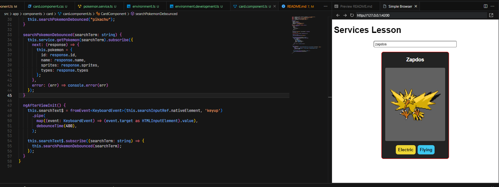

# Angular Pokemon Service

This project is aimed at studying Angular services and components, providing a simple implementation of a Pokemon service and a corresponding card component. If you're new to Angular, this project can serve as a practical example to understand the basics of services, HTTP requests, component interactions, and how to make an debounced input.

## Project Structure

- **pokemon.service.ts**: This file contains the implementation of the `PokemonService`, an Angular service responsible for fetching Pokemon data from the PokeAPI using HTTP requests.

- **card.component.ts**: The `CardComponent` is an Angular component that utilizes the `PokemonService` to display Pokemon information in a card format. It also features a search input with debouncing for smoother user experience.

- **card.component.html**: The HTML template for the `CardComponent`. It includes an input for searching Pokemon and displays relevant information in a card layout.

- **pokemon.ts**: The Pokemon interface file defines the structure of the Pokemon data, including types, abilities, sprites, and other relevant details.

## Project running



## How to Use

1. Clone the repository to your local machine.
2. Open the project in your preferred Angular development environment.
3. Explore and modify the code to understand the implementation of services and components.
4. Run the application using the Angular CLI command: `ng serve`.
5. Open your browser and navigate to `http://localhost:4200/` to see the Pokemon card component in action.

## Getting Started

1. **Install Angular CLI**: If you haven't installed the Angular CLI, you can do so by running the following command in your terminal:
   ```bash
   npm install -g @angular/cli
    ```
2. **Install Dependencies**: Navigate to the project directory and install the project dependencies:

    ```bash
    npm install
    ```
3. **Run the Application**: Use the Angular CLI to run the application locally:
bash
    ```bash
    ng serve
    ```
4. **Explore and Learn**: Review the code in each file to understand how Angular services and components work together to fetch and display Pokemon data.

## Additional Notes
- This project uses the PokeAPI for fetching Pokemon data. Ensure that you have a stable internet connection for the API requests to work.
- Feel free to experiment with the code, make changes, and enhance the functionality as part of your learning process.
